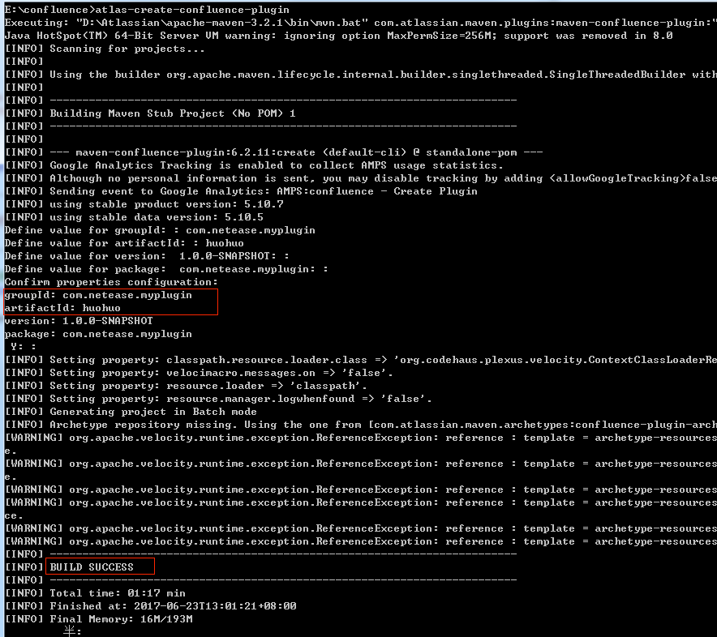

------
<!-- x=0 y=0 z=0 rotate=0 -->
## 
基础环境配置
> 
确保JDK1.8已经安装
> 
确保Java_Home已经配置

------
<!-- x=1300 y=0 z=0 rotate=0 -->
### 
下载最新版本的Atlassian Plugin SDK
#### 
[Atlassian SDK下载](https://marketplace.atlassian.com/download/plugins/atlassian-plugin-sdk-windows)
------
<!-- x=2600 y=0 z=0 rotate=0 -->
### 
双击安装，一路默认

  
------
<!-- x=2600 y=1000 z=0 rotate=0 -->
### 
至此，安装步骤完成
### 
后续操作需要在CMD窗口进行
------
<!-- x=1300 y=1000 z=0 rotate=0 -->
### 
创建插件命令
	cd到你想要创建插件的目录执行以下命令

 
------
<!-- x=0 y=1000 z=0 rotate=90 -->
## 
------
<!-- x=0 y=2000 z=0 rotate=90 -->
### 命令说明
	groupId里面填写的东西就是后面项目里面的文件夹
	artifactId是插件的名称

------
<!-- x=1300 y=2000 z=0 rotate=0 -->
### 
插件目录
##### maven目录：

##### resource目录：

------
<!-- x=2600 y=3000 z=0 rotate=90 -->
## 需要操作的文件
- atlassian-plugin.xml:插件的描述文件
- /META_INf/spring/*.xml:Spring配置文件
- main目录：写java类
> [返回主目录](../index.html)
------
<!-- x=2600 y=5000 z=0 rotate=0 -->
## atlassian-plugin.xml

------
<!-- x=5000 y=5000 z=0 rotate=720 -->
## 常用module
* [Component Import Module](../index.html#/1/2)
* Component Module
* Servlet 相关Module
* Spring 相关Module
* Xwork Module
* [Module种类及说明](https://developer.atlassian.com/confdev/confluence-plugin-guide/confluence-plugin-module-types)
------
<!-- x=5000 y=6500 z=0 rotate=300 -->
## 开始写代码吧
* 运行atlas-mvn eclipse:eclipse适配eclipse
* eclipse导入mvn项目，除了dependency报错请忽略
* 把eclipse中的maven改成atlassian目录的maven
------
<!-- x=6500 y=6500 z=1500 rotate=0 -->
## 编译插件
* 插件目录下运行atlas-run
* 浏览器访问提示的url
* add-ons上传target中的插件

------
<!-- x=8000 y=6500 z=1500 rotate=90 -->
## 调试插件
* atlas-debug --product confluence
* eclipse里面进行配置，默认5005端口
* 5005端口如果找不到，去log里面找address=相关字段

------
<!-- x=8000 y=6500 z=1500 rotate-y=90 -->

------
<!-- x=8000 y=8000 z=1500 rotate-z=180 -->
[Atlassian插件开发流结束](../index.html#1/0)
